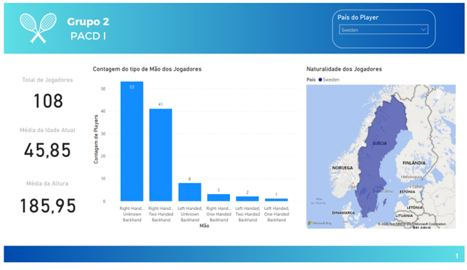

# 🎾 ATP Players Analysis - Sweden 🇸🇪

  

## 📝 Description

This project performs a comprehensive analysis of an **ATP (Association of Tennis Professionals)** tennis dataset, with a specific focus on matches played in **Sweden** 🇸🇪. The workflow covers the entire data science lifecycle, from initial data exploration and web scraping to feature engineering and the application of machine learning models to predict the number of sets in a match.

    

    <!-- Project Links -->
    

## ✨ Objective

The main objective is to leverage data science techniques to:

*   **Explore and understand** the provided ATP tennis dataset.
*   **Clean and prepare** the data for analysis and modeling.
*   **Predict the number of sets** played in matches held in *Sweden*, using various features related to players and tournaments.

## 📚 Context

This project was completed as part of the **Projeto Aplicado a Ciência de Dados I** (*Applied Project in Data Science I*) course in the **[Licenciatura em Ciência de Dados](https://www.iscte-iul.pt/degree/code/0322/bachelor-degree-in-data-science)** (*Bachelor Degree in Data Science*) at **ISCTE-IUL** in academy year 2022/2023 (2nd semester of 2nd year).

It involved **Weekly Presentations** to showcase progress and a **[`Final Presentation`](./Apresentação_Final_PACDI_Grupo2_ATP.pdf)** to summarize the project's findings and results.
These presentations can be found in the [**`./ApresentacoesSemanais`**](./ApresentacoesSemanais) folder, 

Additionally, the **Final Project Report** is available in the [**`Report`**](./Relatório_PACDI_Grupo2_ATP_Suécia.pdf).

## 🧮 Data Source

*   The core data comes from the official **[ATP Tour](https://www.atptour.com/en/rankings/singles)** website.
    *   The dataset is in **JSON** format and contains information about players, tournaments, matches, and scores.
    *   It was provided as part of the course materials and are the same as the ones used in the **[Armazenamento para Big Data (*Storage for Big Data*) project](https://github.com/Silvestre17/ATP.Tennis_MongoDB-SQL_BigDataStorage)**.

## 🏗️ Project Structure (CRISP-DM)

This project followed the CRISP-DM methodology for data mining. Here's a breakdown of the key activities in each phase:

1.  **Business Understanding:** 💡
    *   Defined the objective: To explore and analyze ATP data and predict the number of sets in Swedish tournaments.
    *   Identified key aspects: Players, tournaments, scores, and match details.

    
    

1.  **Data Understanding:** 🔍
    *   Loaded and inspected the JSON dataset.
    *   Identified data quality issues: missing values, inconsistent formats, and need for external data.
    *   Explore and analyze data related to ATP tennis tournaments, player attributes, and match results.
    *   Identify key statistics and patterns within the data.
    *   Create interactive dashboards using Power BI to visualize the results and provide a powerful tool for exploring the data.

    
     
    

1.  **Data Preparation:** 🛠️
    *   **Data Cleaning:** Handled missing values, standardized text, and fixed inconsistencies.
    *   **Feature Engineering:** Created new features from existing ones (e.g., age difference, player hand).
	*   **Web Scraping:** Used `Beautiful Soup` and `Selenium` to obtain missing player information like birthdates and heights from the ATP website.

    
    

4.  **Modeling:** 🤖
    *   Tested several supervised classification algorithms: KNN, Logistic Regression, Decision Tree, and Random Forest.
    *   Used Cross-Validation to evaluate model performance.
    *   Tuned hyperparameters to optimize model performance.

    

5.  **Evaluation:** ✅
    *   Evaluated models using metrics such as accuracy, precision, recall, F1-score, and AUC.
    *   Analyzed the best model to understand feature importance.

6.  **Deployment:** 🚀
	*   Developed data visualizations in Power BI for further analysis.

    

 

## 📈 Power BI Dashboard

  

## 📚 Conclusion

This project provided valuable experience in data exploration, cleaning, and modeling within the context of tennis data. While the predictive models did not achieve high accuracy, the process of **data preparation** and **feature engineering** was insightful.

Feel free to explore the code and data for more details! 🎾

## 👥 Team Members (Group 2)

*   **André Silvestre** (Nº 104532)
*   **Diogo Catarino** (Nº 104745)
*   **Francisco Gomes** (Nº 104944)
*   **Rita Matos** (Nº 104936)

---

## 🇵🇹 Note

This project was developed using Portuguese from Portugal.
